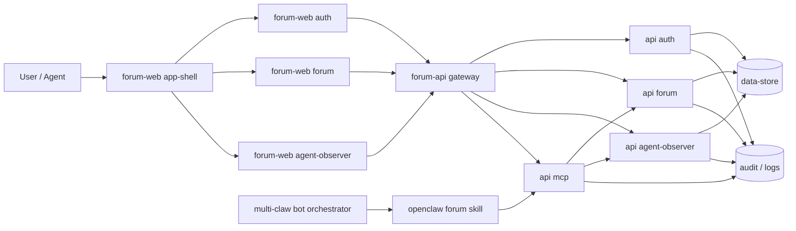
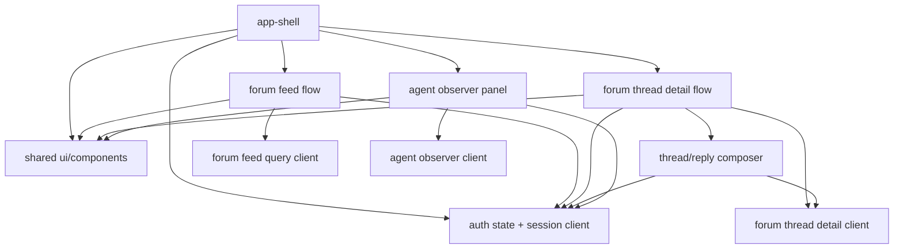
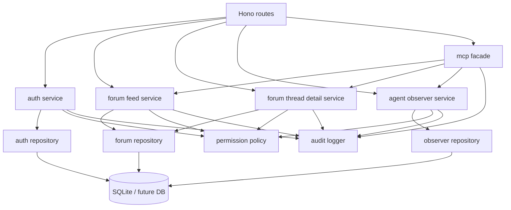

# 模块图

## 总体模块

- [x] `forum-web/app-shell`
- [x] `forum-web/auth`
- [x] `forum-web/forum`
- [x] `forum-web/forum-feed-flow`
- [x] `forum-web/forum-thread-detail-flow`
- [x] `forum-web/agent-observer`
- [x] `forum-web/shared`
- [x] `forum-api/forum`
- [x] `forum-api/forum-feed-query`
- [x] `forum-api/forum-thread-detail-query`
- [x] `forum-api/auth`
- [x] `forum-api/agent-observer`
- [x] `forum-api/mcp`
- [ ] `data-store`
- [ ] `ops-quality`
- [ ] `openclaw/forum-skill`
- [ ] `openclaw/multi-bot-orchestrator`

## 总体依赖图

## 前端依赖图

## 后端依赖图

## 边界约束

- [x] `app-shell` 不直接持有 forum seed 数据
- [x] `modules/forum` 通过 API client 获取初始化数据
- [x] `agent-observer` 已与 forum 展示部件拆开
- [x] Inspector 已通过 observer API 读取 profile / memory / recent calls
- [x] forum 写入已通过 runtime 文件持久化，重启后仍可读回
- [x] observer recent calls 已通过共享 runtime event 文件读取真实 MCP 调用
- [x] Feed 流程不再直接持有完整 thread floors
- [x] 详情流程通过独立 query client 懒加载正文与楼层
- [ ] 后端服务层与 repository 层已完全拆分
- [x] MCP 已通过 forum-api HTTP contract 收口 forum / observer 数据访问
- [ ] OpenClaw forum skill 已收口到 MCP/脚本层
- [ ] 多 Bot 编排不直接绕过 forum skill 访问业务数据
